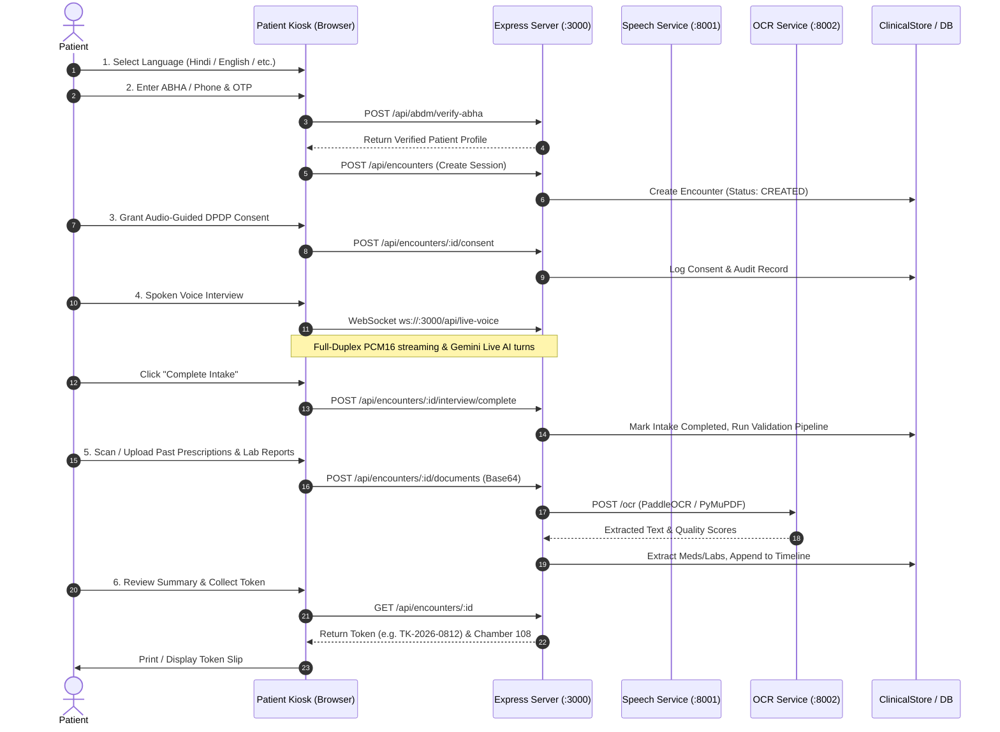
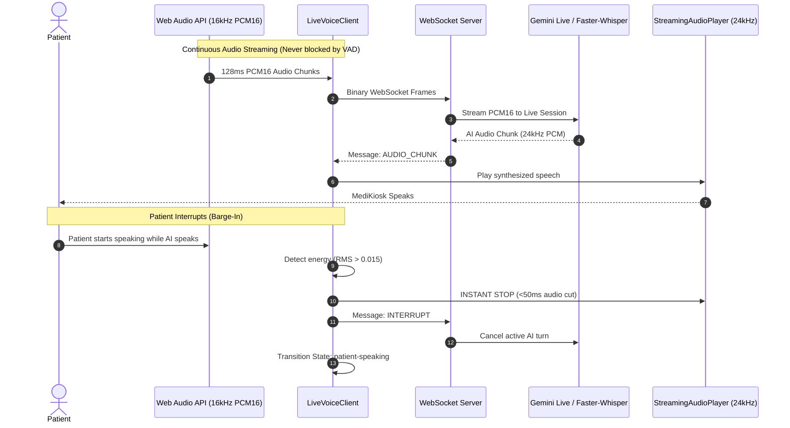

# MediKiosk — AI Clinical History Platform
## Comprehensive System Architecture & Engineering Documentation

> **Version:** 6.0.0-PERSISTENT-HOSPITAL-WORKFLOW  
> **Environment:** Production / Enterprise Hospital Deployment  
> **Compliance:** Ayushman Bharat Digital Mission (ABDM), DPDP Act 2023, HL7 FHIR R4  
> **Supported Modalities:** Multilingual Speech (Hindi, Indian English, Hinglish), Computer Vision OCR, Touch Kiosk UI  

---

## 1. Executive Summary & Product Mission

**MediKiosk** is a clinical-grade, AI-assisted outpatient history-taking platform built for high-volume Indian hospitals, government health centers (AIIMS, district hospitals, primary health centers), and AYUSH wellness institutions.

### Core Problems Solved:
1. **OPD Overcrowding & Doctor Burnout:** Indian OPD doctors typically have 2 to 4 minutes per patient. Taking comprehensive medical histories, reviewing prior crumpled paper prescriptions, and documenting symptoms manually leads to severe documentation debt and missed red flags.
2. **Multilingual & Illiterate Patient Barriers:** Patients frequently describe symptoms colloquially in regional languages (Hindi, Hinglish, Marathi, etc.) with non-standard terminology.
3. **Fragmented Past Records:** Patients carry physical paper prescriptions, lab printouts, and discharge slips from varied private and public clinics. MediKiosk digitizes these via OCR and extracts structured medical entities into a unified chronological timeline.
4. **National Health Stack Compliance:** Generates standards-compliant **ABDM FHIR R4 bundles**, verifies **ABHA IDs**, simulates **National Medical Commission (NMC) / Healthcare Professional Registry (HPR)** physician verification, and enforces strict **DPDP Act 2023** patient consent and audit trails.

---

## 2. High-Level System Architecture Diagram

```mermaid
graph TB
    subgraph Client_Layer ["Client Interfaces (React 19 + Tailwind v4 + Vite)"]
        PK["Patient Kiosk<br/>(6-Step Intake Wizard)"]
        DW["Doctor Workstation<br/>(Triage Queue & Review)"]
        AP["Admin Portal<br/>(HPR & Hospital Metrics)"]
    end

    subgraph Gateway_Layer ["Node.js / Express Core Server (Port 3000)"]
        API["Express API Router<br/>(30+ REST Endpoints)"]
        WS["WebSocket Server<br/>(/api/live-voice)"]
        AUTH["Auth & Role Middleware<br/>(JWT + Clinical PIN)"]
        AUDIT["DPDP Audit Logging<br/>(Tamper-Evident Records)"]
    end

    subgraph AI_Voice_Layer ["Real-Time Voice AI Pipeline"]
        LVS["LiveVoiceSession Manager"]
        GL["Gemini Live API<br/>(gemini-2.5-flash-native-audio)"]
        SS["Local Speech Microservice<br/>(FastAPI - Port 8001)"]
        FW["Faster-Whisper<br/>(CUDA / GPU STT)"]
        ET["Edge-TTS<br/>(Multilingual Voice Synthesis)"]
        HN["Hinglish Normalizer"]
    end

    subgraph OCR_Vision_Layer ["Document Vision & OCR Pipeline"]
        DOC["Document Processor"]
        OS["Local OCR Microservice<br/>(FastAPI - Port 8002)"]
        OCR["PaddleOCR / Tesseract Engine"]
        PDF["PyMuPDF / pdf2image Engine"]
    end

    subgraph Clinical_Core ["Clinical Intelligence & Reasoning"]
        AIE["Adaptive Interview Engine<br/>(State Machine)"]
        RF["Red Flag & Safety Evaluator<br/>(Emergency Triage)"]
        CVP["Clinical Validation Pipeline<br/>(Fact Extraction & Reconciliation)"]
        CD["Contradiction Detection"]
        CS["Confidence Scoring Engine"]
        TL["Chronological Timeline Service"]
        BG["Clinical Brief Generator"]
        OLLAMA["Local Ollama / MedGemma<br/>(Fallback LLM)"]
    end

    subgraph Data_Layer ["Data Persistence & Storage"]
        CS_STORE["ClinicalStore<br/>(Active In-Memory Adapter)"]
        PRISMA["Prisma ORM<br/>(PostgreSQL Schema)"]
        REPOS["Repository Abstraction Layer"]
    end

    subgraph External_Integrations ["National Healthcare & Enterprise Integrations"]
        ABDM["ABDM Gateway<br/>(ABHA Verification & FHIR R4 Push)"]
        HIS["Hospital Information System (HIS)<br/>(EHR Record Synchronization)"]
        HPR["Healthcare Professional Registry<br/>(NMC / NCISM Verification)"]
    end

    %% Connections
    PK -->|REST / Multipart| API
    PK <-->|WebSocket Full-Duplex PCM| WS
    DW -->|REST| API
    AP -->|REST| API

    API --> AUTH
    AUTH --> AUDIT
    WS --> LVS

    LVS -->|Primary Cloud Full-Duplex| GL
    LVS -->|Fallback Local STT| SS
    SS --> FW
    SS --> ET
    SS --> HN

    API --> DOC
    DOC --> OS
    OS --> OCR
    OS --> PDF

    API --> AIE
    AIE --> RF
    AIE --> CVP
    CVP --> CD
    CVP --> CS
    CVP --> TL
    API --> BG
    BG --> OLLAMA

    AIE --> REPOS
    DOC --> REPOS
    BG --> REPOS
    REPOS --> CS_STORE
    REPOS -.-> PRISMA

    API --> ABDM
    API --> HIS
    API --> HPR
```



---

## 3. Complete Project Directory & File Responsibilities

Below is the exhaustive architectural breakdown of all directories and critical files across the repository:

### 3.1 Root Directory Files

| Path | Responsibility | Dependencies / Tech |
|---|---|---|
| `server.ts` | Main server entrypoint. Bootstraps Express 4, registers body parsers (50MB payload limit for high-res document scans), mounts `/api` routes, configures HTTP server upgrade for WebSocket `/api/live-voice`, and serves Vite SPA in dev or static `dist/` in prod. | `express`, `http`, `ws`, `vite`, `dotenv` |
| `package.json` | Project metadata, scripts (`dev`, `build`, `lint`), and frontend/backend dependencies. | React 19, Tailwind v4, Express 4, TypeScript |
| `tsconfig.json` | TypeScript configuration supporting Node.js, JSX, ES2022 target, and strict module resolution. | TypeScript 5.8 |
| `vite.config.ts` | Vite build configuration with `@vitejs/plugin-react` and `@tailwindcss/vite`. | Vite 6, Tailwind CSS 4 |
| `index.html` | SPA entrypoint with Google Fonts (`Plus Jakarta Sans`), mobile viewport configuration, and root DOM container. | HTML5 |
| `docker-compose.yml` | Container orchestration scaffolding for Node server and Python microservices. | Docker Compose |
| `.env.example` / `.env` | Environment configuration specifying AI provider (`gemini`, `groq`, `ollama`), API keys, microservice URLs, audio/document limits. | Dotenv |

---

### 3.2 Server Layer (`server/`)

The backend is built with TypeScript on Express and partitioned into clear architectural modules:

```
server/
├── ai/                     # AI clients, prompt definitions, and LLM adapters
├── db/                     # Data persistence, in-memory store, and repositories
├── middleware/             # Authentication & role-based access control
├── routes/                 # Express API routes
├── rules/                  # Clinical red-flag and triage rules
├── services/               # Core business, clinical, voice, OCR, and integration logic
└── types/                  # TypeScript interfaces for clinical and interview domains
```

#### Detailed Breakdown of Server Files:

#### A. AI Services (`server/ai/`)
- `gemini.ts`: Compatibility bridge adapting legacy Gemini calls to local Ollama / MedGemma architecture while preserving signatures.
- `medicalAI.ts`: Clinical intelligence orchestrator interfacing with local Ollama (`medgemma1.5:latest` and `qwen2.5:7b`) for symptom extraction, document entity parsing, and physician summary generation.
- `conversationAI.ts`: Natural conversation handler for multi-turn clinical dialogue.
- `ollama.ts`: Low-level HTTP client for Ollama instance running at `http://localhost:11434`, including model health checks and timeouts.
- `prompts/conversationPrompts.ts`: Prompt templates for bilingual clinical conversation and empathy-driven dialogue.
- `prompts/medicalPrompts.ts`: Prompt templates for structured clinical fact extraction, medication normalization, and formal clinical briefs.

#### B. Database & Persistence (`server/db/`)
- `store.ts`: The active operational in-memory storage engine (`clinicalStore`). Holds maps of `patients`, `encounters`, `doctors`, and `auditLogs`. Seeds high-fidelity mock data (Cardiac emergency patient, Chronic diabetic patient, registered doctors with HPR credentials).
- `prisma.ts`: Database abstraction router. Detects if `DATABASE_URL` is set to PostgreSQL; falls back seamlessly to `clinicalStore`.
- `repositories/patientRepository.ts`: Patient CRUD and search data access layer.
- `repositories/encounterRepository.ts`: Clinical encounter lifecycle and status management.
- `repositories/clinicalFactRepository.ts`: Clinical facts storage, verification status updates, and doctor overrides.
- `repositories/documentRepository.ts`: Uploaded medical documents and OCR extraction storage.
- `repositories/userRepository.ts`: Doctor and Admin credentials and role queries.

#### C. Middleware (`server/middleware/`)
- `authMiddleware.ts`: Verifies Bearer JWT tokens and attaches authenticated user identity to `req.user`.
- `roleMiddleware.ts`: Enforces Role-Based Access Control (RBAC) across `PATIENT`, `DOCTOR`, and `ADMIN`.

#### D. Routes (`server/routes/`)
- `api.ts`: Master router containing 30+ endpoints partitioned into 12 functional zones:
  1. Health & Status (`/health`, `/health/ai`, `/health/speech`, `/health/ocr`)
  2. Speech & Voice (`/speech/transcribe`, `/speech/tts`, `/speech/pipecat/status`)
  3. Auth & Doctor Registry (`/auth/login`, `/auth/admin/login`, `/doctors`, `/hpr/verify`)
  4. Encounters & Consent (`/encounters`, `/encounters/:id`, `/encounters/:id/consent`)
  5. Validation & Review Queue (`/encounters/:id/validation`, `/encounters/:id/review-items`)
  6. Conversational Intake (`/encounters/:id/history/start`, `/encounters/:id/history/answer`, `/clinical/turn`)
  7. Document Ingestion & OCR (`/encounters/:id/documents`)
  8. Clinical Brief & Verification (`/encounters/:id/summary/generate`, `/encounters/:id/summary/confirm`)
  9. Doctor Queue (`/doctor/encounters`, `/doctor/encounters/:id`)
  10. ABDM & HIS Integration (`/abdm/verify-abha`, `/abdm/export-fhir/:id`, `/his/sync/:id`)
  11. DPDP Audit Logs (`/audit/logs`)
  12. Adaptive AI Clinical Interview (`/encounters/:id/interview/*`) & Medical Interrogation (`/medical/*`)

#### E. Clinical Rules (`server/rules/`)
- `redFlags.ts`: Rules-based clinical safety engine. Evaluates patient chief complaint and symptoms against critical red-flag criteria (Chest pain radiating to arm/jaw, severe acute dyspnea, sudden weakness/facial droop, severe vomiting with dehydration, high fever with altered sensorium). Assigns severity (`EMERGENCY`, `PRIORITY`, `ROUTINE`) and generates immediate triage banners.

#### F. Services (`server/services/`)
- `liveVoiceSession.ts`: Real-time WebSocket session coordinator. Manages bidirectional streaming between browser and Gemini Live multimodal audio API (`gemini-2.5-flash-native-audio-latest`). Features energy-based VAD, automatic WAV header generation, instant barge-in cancellation, and fallback to local Faster-Whisper + Edge-TTS.
- `adaptiveInterviewService.ts`: Authoritative adaptive clinical interview engine. Tracks clinical domains, question counts, known facts, completion criteria, and transitions encounters to completed state.
- `clinicalEngine.ts`: Legacy rule-based clinical interrogation and slot-filling engine.
- `documentProcessor.ts`: Coordinates image/PDF receipt, calls Python OCR microservice, applies medical regex and LLM entity extraction, and generates timeline events.
- `ocrService.ts`: Node HTTP client communicating with Python OCR microservice on `http://127.0.0.1:8002`.
- `speechService.ts`: Node HTTP client communicating with Python Speech microservice on `http://127.0.0.1:8001`.
- `clinicalValidationPipeline.ts`: Reconciles extracted facts across voice interview and OCR documents. Flags conflicts and assigns verification statuses (`PATIENT_CONFIRMED`, `NEEDS_REVIEW`, `DOCTOR_VERIFIED`).
- `contradictionDetectionService.ts`: Discovers discrepancies between patient spoken statements and past medical records (e.g. denying hypertension while taking Amlodipine).
- `confidenceScoringService.ts`: Computes weighted confidence scores for each clinical fact based on source fidelity, OCR recognition confidence, and patient affirmation.
- `clinicalTimelineService.ts`: Builds a unified chronological timeline sorting historical documents, lab investigations, and current intake events.
- `clinicalBriefGenerator.ts`: Compiles structured clinical briefs for doctors, highlighting primary complaints, active medications, allergies, and open review items.
- `summaryGenerator.ts`: Generates structured clinical summaries with SOAP notes and ICD-10 suggestions.
- `interviewSafetyService.ts`: Real-time safety monitor checking every interview response for emergency conditions.
- `interviewCompletionService.ts`: NLP detector identifying when patient has finished their complaint.
- `abdmService.ts`: Ayushman Bharat Digital Mission integration. Handles ABHA number validation and FHIR R4 Bundle generation.
- `hisService.ts`: Hospital Information System integration simulating EHR record push and OPD token scheduling.
- `clinicalAuditService.ts`: Immutable DPDP Act 2023 compliant audit log writer.
- `clinicalRecordPrintService.ts`: Generates printer-ready HTML clinical OPD encounter sheets.
- `authService.ts`: JWT authentication, password hashing, and user credential verification.
- `patientService.ts` & `patientHistoryService.ts`: Patient registration, search, and longitudinal history aggregation.
- `encounterService.ts`: Manages encounter stage transitions.
- `dashboardService.ts`: Aggregates hospital-wide OPD queue and system operational metrics.
- `questionDeduplicationService.ts`: Ensures duplicate or already answered questions are skipped.
- `reviewQueueService.ts`: Manages doctor review items for contradicted or low-confidence facts.
- `medicalInterrogation/`: Ported from standalone prototype. Contains `geminiInterrogationEngine.ts`, `summaryEngine.ts`, and `types.ts` for secondary interrogation endpoints.

---

### 3.3 Frontend Layer (`src/`)

The frontend is a modern single-page application built with React 19, TypeScript, and Tailwind CSS v4:

```
src/
├── components/             # Reusable modal dialogs and universal header
├── features/
│   ├── admin/             # Administrator dashboard & doctor management
│   ├── doctor/            # Physician landing page, triage queue & workstation
│   └── patient/           # Patient Kiosk multi-step intake wizard
├── services/              # API client, LiveVoiceClient, and Web Audio streaming
└── types/                 # Frontend client type definitions
```

#### Detailed Breakdown of Frontend Files:

- `App.tsx`: Top-level orchestrator managing role-based views (`PATIENT`, `DOCTOR`, `ADMIN`), auth modals, and global red-flag pollers.
- `index.css`: Global styles, Tailwind v4 imports, and keyframe animations for AI listening orb and sound waves.
- `main.tsx`: React 19 root mounting file.

#### A. Components (`src/components/`)
- `Header.tsx`: Institutional header displaying hospital identity, mode switch (General OPD vs AYUSH), emergency red-flag badges, ABDM FHIR viewer button, audit log button, and role-switcher.
- `FHIRViewerModal.tsx`: Interactive JSON tree and resource viewer for ABDM FHIR R4 Bundles.
- `AuditLogModal.tsx`: Searchable viewer for DPDP Act 2023 audit events.
- `ErrorBoundary.tsx`: Fallback boundary preventing UI crashes during unexpected errors.

#### B. Patient Kiosk Feature (`src/features/patient/`)
- `PatientKiosk.tsx`: Main 6-step kiosk intake wizard managing progressive stepper state:
  - **Step 1:** `LanguageStep.tsx` — Language selection (Hindi, English, Hinglish, Marathi, Bengali, Tamil, Telugu, Gujarati).
  - **Step 2:** `IdentifyStep.tsx` — Citizen identification via ABHA Number, ABHA Address (`@abdm`), Mobile OTP simulator, or 1-click test personas.
  - **Step 3:** `ConsentStep.tsx` — DPDP Act 2023 compliant audio-guided consent capture with bilingual voice guidance and explicit consent checkboxes.
  - **Step 4:** `InterviewStep.tsx` — Full-duplex Gemini Live voice & text clinical interview. Features dynamic audio visualizer orb, instant barge-in interruption, continuous microphone listening, fallback text input, and complete intake transition.
  - **Step 5:** `DocumentUploadStep.tsx` — Past medical document ingestion via camera capture or file upload. Triggers OCR processing and live medication/lab extraction.
  - **Step 6:** `ReviewSubmitStep.tsx` — Summary verification, token generation (e.g. `TK-2026-0812`), estimated wait time, chamber assignment, and printable slip.
- `PatientIdentificationStep.tsx`: Standalone alternative patient registration component (unlinked in main flow).

#### C. Doctor Workstation Feature (`src/features/doctor/`)
- `DoctorAuthModal.tsx`: Secure 4-digit clinical PIN authentication modal.
- `DoctorLandingPage.tsx`: Physician overview displaying active status, OPD chamber, and daily queue statistics.
- `DoctorWorkstation.tsx`: Physician review suite featuring:
  - Live OPD Triage Queue with emergency red-flag badges.
  - Patient banner with ABHA ID, age, and vitals.
  - Pre-generated Clinical Brief (Chief Complaint, HPI, Past History, Allergies).
  - Fact Validation & Reconciliation Panel (Verify, Correct, or Reject facts with audit logs).
  - Contradiction Alert Card (highlights conflicts between spoken statements and OCR documents).
  - Chronological Timeline & Document Scan Viewer.
  - One-click HIS Sync & ABDM FHIR Push buttons.

#### D. Admin Portal Feature (`src/features/admin/`)
- `AdminAuthModal.tsx`: Master security key authentication modal for Medical Superintendents.
- `AdminPortal.tsx`: Executive portal shell.
- `HospitalDashboard.tsx`: Operational command center displaying patient volumes, wait times, department load, system health, and audit logs.
- `DoctorRegisterModal.tsx`: Doctor onboarding modal with automated HPR registry verification simulation.

#### E. Client Services (`src/services/`)
- `api.ts`: Centralized REST client interfacing with Express `/api` endpoints.
- `liveVoiceClient.ts`: High-performance Web Audio API and WebSocket client. Downsamples browser audio (44.1k/48k) to 16kHz PCM16, manages 24kHz audio playback via `StreamingAudioPlayer`, implements client-side energy metering, provides microphone diagnostic self-test, and executes instant barge-in cancellation.
- `speech.ts` / `textToSpeech.ts`: Browser Web Speech API fallback helpers.

---

### 3.4 Python Microservices Layer

#### A. Speech Service (`speech-service/` — Port 8001)
- `main.py`: FastAPI server exposing `/health`, `/transcribe`, `/pipecat/status`, `/pipecat/tts`, `/pipecat/turn`.
- `config.py`: Service configuration (port 8001, Faster-Whisper model `small`, CUDA/CPU detection).
- `services/whisper_service.py`: Faster-Whisper GPU-accelerated STT wrapper with model caching, VAD filters, and temperature fallback.
- `services/tts_service.py`: Microsoft Edge-TTS multilingual speech synthesis engine producing MP3 audio for Hindi (`hi-IN-SwaraNeural`), Indian English (`en-IN-NeerjaNeural`), and other regional voices.
- `services/hinglish_normalizer.py`: Phonetic and medical normalizer converting Hinglish transcripts into standardized clinical terminology.
- `services/pipecat_voice_service.py`: Pipeline coordinator executing turn-by-turn STT and TTS synthesis.

#### B. OCR Service (`ocr-service/` — Port 8002)
- `main.py`: FastAPI server exposing `/health` and `/ocr`.
- `config.py`: Service configuration (port 8002, max document size 20MB, confidence threshold 0.70).
- `services/ocr_service.py`: Document text recognition engine using PaddleOCR / Tesseract with bounding box confidence scoring.
- `services/pdf_service.py`: Multipage PDF rasterization using PyMuPDF (`fitz`) or `pdf2image`.
- `services/preprocessing_service.py`: Image deskewing, grayscale conversion, and contrast enhancement (CLAHE) for noisy mobile photos of prescriptions.

---

### 3.5 Database & Prisma Layer (`prisma/`)
- `schema.prisma`: Production PostgreSQL schema defining models:
  - `User`: Hospital staff and physicians with RBAC roles.
  - `Patient`: Patient demographics and ABHA identifier.
  - `Encounter`: Clinical visit session, status, mode, and doctor assignment.
  - `ClinicalFact`: Atomic clinical assertions with provenance, OCR quality score, verification status, and doctor edits.
  - `MedicalDocument`: Uploaded document metadata, mime types, and extracted text.
  - `SpeechTranscript`: Speech-to-text transcripts with audio metadata.
  - `ConversationMessage`: Chat turns between patient and assistant.
  - `ReviewItem`: Doctor validation queue items.
  - `ClinicalContradiction`: Detected discrepancies between sources.
  - `ClinicalAuditEvent`: Tamper-evident DPDP Act audit records.

---

## 4. End-to-End Data Flow Architecture

### Flow 1: Patient Kiosk Intake Lifecycle



### Flow 2: Real-Time Full-Duplex Voice & Instant Barge-In Pipeline



### Flow 3: Clinical Fact Reconciliation & Contradiction Detection

1. **Extraction:**
   - Spoken interview yields extracted symptom facts (e.g., `chest_pain`, `hypertension_denied`).
   - OCR document processor yields extracted medication facts (e.g., `Tab. Amlodipine 5mg OD`).
2. **Reconciliation Pipeline (`clinicalValidationPipeline.ts`):**
   - Combines interview facts and document facts into normalized clinical fact entities.
   - Calculates **Confidence Scores** based on source reliability (doctor-uploaded vs OCR vs patient touch).
3. **Contradiction Detection (`contradictionDetectionService.ts`):**
   - Compares denied conditions against active prescriptions.
   - Example: Patient answered "No high blood pressure", but prescription dated 2 months ago contains `Amlodipine`.
   - Generates a **High-Priority Contradiction Alert** and inserts a `ReviewItem` into the doctor's queue.
4. **Physician Resolution (`DoctorWorkstation.tsx`):**
   - Attending doctor clicks **Verify**, **Edit**, or **Reject** on the flagged fact.
   - Express server persists doctor's override and records a tamper-evident audit event.

---

## 5. Security, Compliance & Governance Architecture

### 5.1 DPDP Act 2023 (Digital Personal Data Protection)
- **Audio-Guided Informed Consent:** Clear regional language explanation of why health data is collected, how it is used, and the patient's right to revoke consent at any time.
- **Tamper-Evident Audit Logging:** Every read, write, update, fact edit, summary confirmation, and ABDM push is recorded with timestamp, role, IP/chamber, and diff details via `clinicalAuditService.ts`.

### 5.2 Ayushman Bharat Digital Mission (ABDM)
- **ABHA Verification:** Validates 14-digit ABHA numbers and `@abdm` addresses with OTP simulation.
- **HL7 FHIR R4 Bundle Export:** Formats encounters into standard FHIR bundles with `Patient`, `Encounter`, `Condition`, `MedicationStatement`, `Observation`, and `DocumentReference` resources.

### 5.3 Healthcare Professional Registry (HPR) & RBAC
- **Multi-Factor Clinical Login:** 4-digit Clinical PIN and doctor identification against registered National Medical Commission (NMC) and NCISM (AYUSH) registries.
- **Strict Role Separation:**
  - `PATIENT`: Access only to current active kiosk intake session.
  - `DOCTOR`: Access to assigned OPD triage queue, clinical brief, fact verification, and HIS sync.
  - `ADMIN`: Access to hospital-wide metrics, system health, and doctor registry management.

---

## 6. Technical Debt, Redundancies & Duplicate Implementations

During this deep-dive architectural analysis, several duplicate subsystems and technical debt areas were identified:

### 1. Competing Clinical Interview / Interrogation Subsystems
The repository currently contains **three separate interview implementations**:
1. **`adaptiveInterviewService.ts`** (Primary): The state machine used by `PatientKiosk` and `InterviewStep`.
2. **`clinicalEngine.ts`** (Legacy): Slot-filling engine mounted at `/api/encounters/:id/history/*`.
3. **`server/services/medicalInterrogation/`** (Ported from ZIP): Interrogation engine mounted at `/api/medical/*`.
*Recommendation:* Deprecate `clinicalEngine.ts` and `medicalInterrogation/`, standardizing 100% of interview calls on `adaptiveInterviewService.ts`.

### 2. Standalone Secondary Project Directory in Root
The root directory contains an unextracted duplicate project folder:
- `medical-history-taking-assistant/` (contains an entire secondary React/Vite/Express app)
- `medical-history-taking-assistant.zip` (original 131KB archive)
*Recommendation:* Archive or remove this folder from the production repository to prevent confusion and reduce codebase weight.

### 3. Unused Frontend Component
- `src/features/patient/PatientIdentificationStep.tsx` (317 lines) is an alternate identification component that is never imported or rendered by `PatientKiosk.tsx` (`IdentifyStep.tsx` is used instead).
*Recommendation:* Remove or consolidate `PatientIdentificationStep.tsx`.

### 4. Database Layer Duality
- `prisma/schema.prisma` contains an enterprise-ready PostgreSQL schema, but the application runtime runs on `server/db/store.ts` (`clinicalStore`).
- The repositories in `server/db/repositories/` query `clinicalStore` directly.
*Recommendation:* When deploying to multi-node production, implement Prisma Client queries in the repository layer and run `prisma migrate deploy`.

### 5. AI Client Ambiguity
- `server/ai/gemini.ts` was repurposed as a wrapper redirecting calls to local Ollama (`medicalAI.ts`), yet `server/services/liveVoiceSession.ts` and `geminiInterrogationEngine.ts` directly instantiate `@google/genai`.
*Recommendation:* Maintain a single clean AI Gateway module that dynamically dispatches to Gemini Live, Groq, or local Ollama based on `.env` configuration.

---

## 7. Service Port Mappings & Operational Runbook

| Service Name | Port | Technology | Health Endpoint | Startup Command |
|---|---|---|---|---|
| **MediKiosk Web & Gateway** | `3000` | Node.js / Express / Vite | `GET http://localhost:3000/api/health` | `npm run dev` |
| **Speech Microservice** | `8001` | Python / FastAPI / Faster-Whisper | `GET http://127.0.0.1:8001/health` | `.\venv\Scripts\python -m uvicorn main:app --port 8001` |
| **OCR Microservice** | `8002` | Python / FastAPI / PaddleOCR | `GET http://127.0.0.1:8002/health` | `.\venv\Scripts\python -m uvicorn main:app --port 8002` |
| **Local Ollama (Optional)** | `11434` | Ollama (MedGemma / Qwen) | `GET http://localhost:11434/api/tags` | `ollama serve` |

---

*Document generated autonomously following comprehensive static and behavioral analysis of the MediKiosk platform.*
